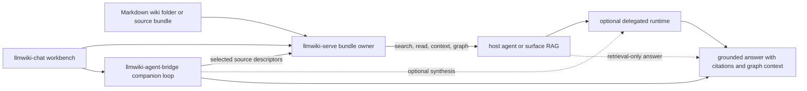

# Architecture

The toolchain is split across small repositories and host-owned integration
surfaces so each runtime role can stay explicit, testable, and replaceable.

## Runtime Roles

| Component | Role | Owns | Does not own |
| --- | --- | --- | --- |
| `llmwiki-serve` | Served Knowledge Source bundle owner | Source loading, parsing, read-only projection, source manifest, opaque source/page/chunk/graph handles, raw-origin metadata, graph-aware retrieval primitives, HTTP and MCP tool surfaces, optional A2A source compatibility | Wiki authoring, ingestion or compile jobs, host-owned RAG UX, model inference, runtime planning, answer synthesis, browser UI |
| `llmwiki-agent-bridge` | Companion bridge loop | Selected-source fan-out, evidence bundle assembly, optional runtime profile calls, A2A/MCP bridge surfaces, normalized evidence-only or runtime-backed answer artifacts | Source bundle storage, source indexing, UI state, managed hosted runtime, host product policy |
| `llmwiki-chat` | Browser workbench | Knowledge Source setup, graph and page inspection, bridge selection, trace and answer display | Serving wiki files, launching production runtimes, owning production credentials, storing host private wiki data permanently |
| Host agents | Direct retrieval planners | Host-owned search loop, tool-call iteration, answer composition, prompt policy, citation display, local workflow integration | Source bundle internals, opaque handle semantics, delegated runtime implementation |
| Delegated runtimes | Inference or tool execution target | Model invocation, local gateway behavior, runtime-specific tool execution, token budgeting, streaming behavior | Source discovery, source bundle state, raw-origin resolution, host UI state |
| Host-owned surface RAG | Product or workflow answer surface | User-facing retrieval UX, auth and policy, cross-system ranking, prompt assembly, answer memory, telemetry, cache policy | `llmwiki-serve` bundle boundary, source parsing, canonical handle generation, raw-origin provenance |
| Served Knowledge Source bundle | Read-only source boundary | Manifest, pages, chunks, links, tags, graph projections, raw-origin records, source-version identity as exposed by `llmwiki-serve` | Live authoring writes, runtime credentials, host answer logs, bridge trace storage |

## End-to-End Flow

`llmwiki-serve` is the only component that needs direct filesystem access to a
wiki folder. The bridge and chat client interact with sources over network
protocols. Host agents may either call `llmwiki-serve` directly or delegate the
evidence fan-out loop to `llmwiki-agent-bridge`. The bridge can return an
evidence-only result, or call a delegated runtime when synthesis is configured.

## Projection Model

`llmwiki-serve` treats the source folder as the source of truth. It derives:

- a manifest for discovery
- approved context snippets
- search results
- page read payloads
- graph nodes and edges
- optional graph facts from sidecar data
- raw-origin records that tie derived evidence back to files, URLs, commits,
  sections, or line ranges when available

Draft or unpublished pages are withheld by default from read, search, context,
and graph responses. Operators can enable draft access only for trusted local
inspection.

## Source Bundle Boundary

A served Knowledge Source bundle is the read-only boundary exposed by
`llmwiki-serve`. Today it is projected from a local supported wiki folder.
Archives and packed generated bundles are future source shapes; clients should
still consume them through the same source protocols when they arrive.

| Boundary item | Owner | Rule |
| --- | --- | --- |
| Bundle registry and version identity | `llmwiki-serve` | Clients discover bundles through the source manifest and should not infer local paths or storage layout. |
| Opaque handles | `llmwiki-serve` | Source, page, chunk, section, edge, and fact handles are passed back to `llmwiki-serve`; clients must not parse them for meaning. |
| Raw-origin metadata | `llmwiki-serve` | Returned evidence should preserve origin IDs, paths or URLs, source references, commits or snapshots, headings, and line or byte ranges when available. |
| Derived projections | `llmwiki-serve` | Search results, context packs, page reads, and graph projections are cacheable derived views, not new source-of-truth documents. |
| Evidence and answer artifacts | Host agents or `llmwiki-agent-bridge` | Runtime evidence bundles and answers can cite handles and origins, but they do not own the served bundle. |

Opaque handles make source bundles portable across local folders, hosted
endpoints, and future packed formats. Raw-origin metadata keeps the handles
auditable without making clients depend on private filesystem structure.

Source-bundle manifests and current-evidence descriptors belong at this
boundary. They can tell a host loop or bridge loop how to coordinate deeper
raw-source RAG where a source policy allows it, but they remain descriptors of
the `llmwiki-serve` projection rather than bridge-owned storage or raw file
access.

## Integration Choices

Use direct source calls when the agent runtime can retrieve context and compose
answers itself.

Use `llmwiki-agent-bridge` when a client needs one HTTP service that gathers
evidence from selected sources and returns a stable artifact shape. Runtime
synthesis is optional and only happens in runtime-backed bridge modes.

Use `llmwiki-chat` when a human needs to inspect sources, choose a bridge, ask
questions, review trace steps, and view cited answers in a browser.

## Retrieval Loop Ownership

There are two supported orchestration loops.

| Loop | Owner | Flow | Use when |
| --- | --- | --- | --- |
| Host-owned search loop | Host agent or host-owned surface RAG | The host calls `llmwiki-serve` search, read, context, and graph primitives, then performs any model calls and answer composition itself. | The host already has a tool loop, prompt policy, product UI, answer memory, or custom ranking layer. |
| Companion-owned bridge loop | `llmwiki-agent-bridge` | The client sends a question and selected Knowledge Source descriptors or registered endpoint IDs; the bridge gathers evidence, then either returns evidence-only artifacts or calls the delegated runtime and returns a normalized answer artifact. | The client wants one local service to own evidence fan-out, optional runtime prompting, trace assembly, and citation normalization. |

The loops should not silently share ownership. If a host surface adds its own RAG
ranking, cache, prompt assembly, or policy checks, that remains host-owned even
when the underlying evidence comes from `llmwiki-serve`. If the bridge assembles
and normalizes the answer artifact, the host should treat that artifact as a
bridge result rather than as a raw source response.

When source-bundle or current-evidence descriptors are present, hosts and the
bridge can use them to coordinate additional approved retrieval. That does not
move source projection, raw-origin resolution, ranking policy, or surface RAG
ownership into the bridge.

## Target Retrieval Design

The target retrieval contract is graph-aware instead of text-only. Implementations
can expose these primitives through HTTP, MCP, or A2A compatibility without
changing the ownership boundary.

| Primitive | Purpose | Expected metadata |
| --- | --- | --- |
| Search | Find candidate pages, chunks, headings, tags, references, and graph facts. | Scores, matched fields, bundle/source handle, page or chunk handle, raw-origin summary. |
| Context | Return a ranked evidence pack with orientation pages, limitations, citations, and graph hints. | Evidence handles, citation records, graph hints, retrieval trace IDs, raw-origin metadata. |
| Read | Resolve an opaque handle into an approved page, section, chunk, or fact payload. | Stable handle, title, headings, source references, draft/public status, raw-origin metadata. |
| Graph | Return nodes, edges, neighborhoods, paths, references, and sidecar facts relevant to the query or handle. | Node and edge handles, relation types, weights or scores when available, origin records for graph facts. |
| Origin resolution | Explain where returned evidence came from without exposing private storage assumptions. | File path or URL when policy allows, commit or snapshot, front matter IDs, heading anchors, line or byte ranges. |

Raw-origin metadata is a target design requirement for OSS readiness because it
lets downstream agents cite, debug, and test retrieval results without depending
on undocumented parser behavior.

## Deployment Shapes

| Shape | Fit | Notes |
| --- | --- | --- |
| Local-only source | Personal wiki, source-clone development | Bind to `127.0.0.1`, keep default local CORS, and avoid exposing draft data. |
| Shared source endpoint | Team wiki or internal service | Put TLS, authentication, monitoring, and explicit CORS policy in front of the source. |
| Browser console with public source | Demos and read-only public knowledge | Prefer HTTPS source URLs and avoid private network assumptions. |
| Bridge-backed runtime | Local Hermes, DeepAgents, or compatible runtime | Configure the bridge process explicitly, keep runtime credentials out of browser storage, and choose A2A or MCP at the bridge boundary. |

## Protocol Posture

`llmwiki-serve` is primarily a source projection and retrieval server. HTTP and
MCP are the natural first-class integration paths because agents can call tools
for search, read, graph, and context retrieval while keeping planning and answer
composition in their own runtime.

A2A on `llmwiki-serve` is a compatibility adapter, not the default product
identity. Enable it when an A2A-native client can only discover sources through
an agent-card-shaped surface. For synthesis, multi-source routing, model calls,
and trace normalization, use `llmwiki-agent-bridge`.

| Surface | Owner | Used for | Returned artifact |
| --- | --- | --- | --- |
| HTTP source endpoints | `llmwiki-serve` | Direct context, search, read, graph retrieval. | Context packs, pages, graph projections. |
| MCP source tools | `llmwiki-serve` | Tool-oriented direct source retrieval. | `llmwiki_context`, search, read, graph tool results. |
| A2A source compatibility | `llmwiki-serve`, opt-in | A2A-native source discovery when a client cannot call HTTP/MCP directly. | `llmwiki_context` source artifact. |
| Agent Bridge A2A | `llmwiki-agent-bridge` | Bridge-facing evidence fan-out and optional answer synthesis from selected sources. | `llmwiki_agent_result` artifact. |
| Agent Bridge MCP | `llmwiki-agent-bridge` | MCP clients that want one bridge tool for evidence-only or runtime-backed grounded answering. | `structuredContent.llmwiki_agent_result`. |

## Ownership Boundaries

Each repository should be releasable on its own. Cross-repo changes should
document the protocol or adapter expectation they rely on, then update this
portal when the user-facing workflow changes.

## OSS Readiness And E2E Expectations

Open-source readiness depends on reproducible fixtures and end-to-end checks
that do not require private repositories, private wiki data, or live model keys.

- `llmwiki-serve` should have fixture bundles that verify source loading, draft
  filtering, opaque handle round trips, raw-origin metadata, graph projections,
  and HTTP/MCP parity.
- Direct host-loop tests should exercise search, context, read, and graph calls
  against a fixture source, then verify citations can be composed without the
  bridge.
- Bridge-loop tests should run against fixture sources and a mocked or local
  OpenAI-compatible runtime, then verify evidence fan-out, trace steps,
  citations, graph data, and normalized answer artifacts.
- `llmwiki-chat` tests should use public fixtures or mocked endpoints, verify
  source and bridge selection, and avoid storing runtime secrets in browser
  state.
- Release checks should include documentation builds, protocol fixture tests,
  public-license checks, and smoke tests that can run in CI without network
  access except where a test explicitly opts in.
