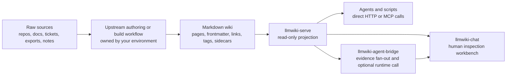

# Data Flow

The docs describe a read-only source layer, not a new authoring or ingestion
system. The normal path is:

## Step 1: Raw Sources

Raw sources are the materials your team already uses: repositories, design
docs, issue trackers, PDFs, meeting notes, exported web pages, research notes,
or an existing Obsidian vault. These are not read directly by
`llmwiki-serve`.

## Step 2: Upstream Authoring Or Build

An upstream workflow turns raw sources into a Markdown wiki. That workflow may
be a compatible wiki compiler, an Obsidian authoring process, a local script,
a CI job, or a manual docs process. It is not part of `llmwiki-serve`,
`llmwiki-agent-bridge`, or `llmwiki-chat`.

`llmwiki-serve` does not run this step. It detects the Markdown and sidecar
files that the upstream workflow writes after they exist on disk.

## Step 3: Markdown Wiki

The Markdown wiki is the durable source of truth for this docs stack. It can
contain pages, YAML frontmatter, headings, wikilinks, Markdown links, tags,
source references, and optional graph sidecar files.

The same folder may also be useful in authoring tools such as Obsidian. Those
tools can help humans browse and edit the wiki; they are not required for
`llmwiki-serve` to project the wiki to agents.

## Step 4: Read-Only Projection

A projection is a read-only view derived from the Markdown wiki. In plain
English: `llmwiki-serve` looks at the files, builds stable API responses from
them, and serves those responses without becoming the owner of the files.

The projection can include:

- source manifest and bundle metadata
- approved page reads
- search and context results
- graph nodes and edges derived from links, tags, headings, source references,
  and sidecars
- citations and raw-origin metadata when available

If a Markdown page changes, the projection can be rebuilt from that page. If
the server stops, the Markdown wiki remains intact.

## Step 5: Agents, Bridge, And Chat

After `llmwiki-serve` exposes the projection, clients choose how to consume it:

| Consumer | How it uses the projection |
| --- | --- |
| Agents, scripts, IDE tools, and host apps | Call `llmwiki-serve` directly over HTTP or MCP-style tools, then own their own planning, prompting, answer synthesis, and citation display. |
| `llmwiki-agent-bridge` | Calls one or more selected Knowledge Sources, gathers evidence, and optionally calls an external OpenAI-compatible runtime before returning a normalized answer artifact. |
| `llmwiki-chat` | Lets a human test source readiness, inspect pages and graph context, select a bridge, ask questions, and review citations and trace steps. |

The bridge and chat workbench do not read the wiki folder directly. They talk
to the source projection through network APIs.

## Projection Versus Obsidian Graph View

Obsidian's graph view is an editor feature for humans. It helps people see
links inside a vault while they write and navigate notes.

The `llmwiki-serve` graph projection is an agent-facing API view. It converts
links, tags, headings, source references, and optional sidecar facts into
structured responses that agents, bridges, tests, and UI workbenches can query.

The two views can describe the same Markdown folder, but they are not the same
thing. Obsidian owns the authoring experience; `llmwiki-serve` owns the
read-only source projection.

## Boundary Rule

When something seems confusing, use this ownership rule:

| Stage | Owner |
| --- | --- |
| Raw source collection | Your upstream tools and workflows |
| Upstream authoring or build | Your compiler, scripts, authoring process, or CI |
| Markdown wiki files | The wiki repository or folder owner |
| Projection and source APIs | `llmwiki-serve` |
| Evidence fan-out or runtime-backed answer artifact | `llmwiki-agent-bridge` when used |
| Human source inspection and answer review | `llmwiki-chat` when used |
| Final product UX, memory, policy, and telemetry | The host agent or application |
