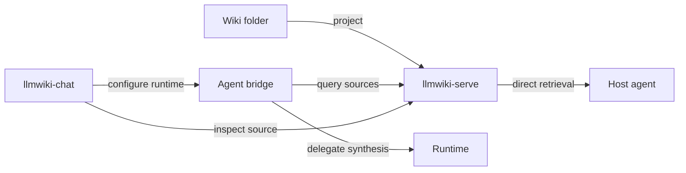

  

    <strong>Minimum useful path</strong>
    Run <code>llmwiki-serve</code> on your graph or <code>./examples/sample-wiki</code>, then query <code>/query</code>. Chat and model runtimes are optional.
  

  

    <strong>Public-preview install</strong>
    Use source checkouts today. PyPI and npm package commands become primary after publication gates pass.
  

  

    <strong>Protocol posture</strong>
    HTTP and MCP source access first; A2A source compatibility is opt-in. The bridge offers A2A and MCP runtime-facing surfaces.
  

## Module Map

| Module | Owns | Does not own |
| --- | --- | --- |
| `llmwiki-serve` | File projection, manifest, context packs, search, read, graph, HTTP, MCP, optional A2A source compatibility. | Wiki authoring, ingestion jobs, model calls, answer synthesis, browser UI. |
| `llmwiki-agent-bridge` | Source fan-out, runtime profile config, OpenAI-compatible chat completions call, normalized answer artifact, citations, graph, trace. | Reading local files directly, hosting a model, browser source selection UI. |
| `llmwiki-chat` | Source setup, bridge/runtime setup, graph inspection, answer review, run details, citation selection. | Serving wiki files, storing provider secrets, production answer quality. |
| `llmwiki-docs` | Cross-repo first-run path, architecture, protocol posture, release status, operations references. | Package runtime behavior or upstream LLM Wiki specification ownership. |

## Choose Your Path

  <a class="route-card" href="./quickstart">
    First 10 minutes
    <strong>Serve and query a wiki</strong>
    
Use your existing graph, or start with the bundled sample for the fastest known-good smoke.

  </a>
  <a class="route-card" href="./direct-agent-integrations">
    Codex, Claude Code, IDE agents
    <strong>Call the source directly</strong>
    
Best when the agent can retrieve context and do its own planning, editing, and synthesis.

  </a>
  <a class="route-card" href="./runtime-adapters">
    Hermes, DeepAgents, local runtimes
    <strong>Add the Agent Bridge</strong>
    
Use the bridge when one service should gather source evidence and return a model-backed answer artifact.

  </a>
  <a class="route-card" href="./network-security">
    Private or team network
    <strong>Check exposure boundaries</strong>
    
Review loopback defaults, private HTTP, CORS, source policy, bearer tokens, and TLS before sharing endpoints.

  </a>

## First Run At A Glance

  <a class="quickstart-step" href="./quickstart#start-llmwiki-serve">
    Step 1
    <strong>Start your source</strong>
    
Serve an existing wiki folder, or use <code>./examples/sample-wiki</code> for a known-good smoke.

  </a>
  <a class="quickstart-step" href="./quickstart#query-it-directly">
    Step 2
    <strong>Verify projection</strong>
    
Call <code>/health</code>, <code>/manifest</code>, and <code>/query</code>. Stop here if direct retrieval is enough.

  </a>
  <a class="quickstart-step" href="./quickstart#optional-agent-bridge">
    Optional
    <strong>Start the bridge</strong>
    
Use evidence-only source fan-out first. Connect a runtime only when the bridge should synthesize answers.

  </a>
  <a class="quickstart-step" href="./quickstart#optional-chat-workbench">
    Optional
    <strong>Open chat</strong>
    
Test the source and bridge, ask a question, then inspect citations, graph context, artifacts, and run details.

  </a>

## What To Read Next

| Goal | Page |
| --- | --- |
| Run the first local path | [Quickstart](/quickstart) |
| Understand the vocabulary | [Core Concepts](/core-concepts) |
| Decide direct source vs bridge vs chat | [Architecture](/architecture) and [Runtime Adapters](/runtime-adapters) |
| Connect Codex, Claude Code, Copilot-style IDE agents, or scripts | [Direct Agent Integrations](/direct-agent-integrations) and [AI Tool Support](/ai-tools) |
| Understand HTTP, MCP, and A2A-style compatibility surfaces | [Protocols](/protocols) and [API Reference](/api-reference) |
| Expose endpoints beyond loopback | [Network & Security](/network-security) and [Deployment](/deployment) |
| Check package/public-preview status | [Release Status & Compatibility](/status) |
| Prepare endpoint operations | [Deployment](/deployment), [Network & Security](/network-security), and [Troubleshooting](/troubleshooting) |
| Check public-preview support status | [Release Status & Compatibility](/status) and [FAQ](/faq) |

::: info Public preview
This is independent community tooling for LLM Wiki-style Markdown knowledge
folders and agent-readable context. It is not an official project from Andrej
Karpathy or any upstream producer named in compatibility examples, and it does
not claim certified MCP or A2A conformance.
:::
