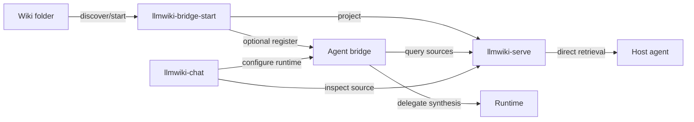

<section class="purpose-panel" id="what-this-is">
  

    
Problem first

    <h2>Your project context already lives in local files.</h2>
    

      Personal and team workflows often already have useful project knowledge in
      LLMWiki, Markdown, or Obsidian folders. The first problem is not
      orchestration; it is making that existing folder readable by an agent
      without moving private files into a new hosted system.
    

    

      The default path is intentionally small: run <code>llmwiki-serve</code>
      beside one folder, verify the cited source view, and connect it to Codex,
      Claude Code, Copilot-style agents, IDE extensions, or scripts. Bridge,
      bridge-start, and chat are later modules for specific hurdles after the
      source works.
    

  

  

    <strong>Start here when you want to...</strong>
    <ul>
      <li>Reuse an existing project wiki without moving the files.</li>
      <li>Give a coding agent project-specific memory on demand.</li>
      <li>Keep evidence, citations, and graph context visible during agent work.</li>
      <li>Decide later whether multi-source bridge, guided setup, or chat UI is worth adding.</li>
    </ul>
  

</section>

  <a href="./quickstart">
    <strong>Use the folder you already have</strong>
    Keep project knowledge in its current LLMWiki, Markdown, or Obsidian folder. Serve it read-only instead of migrating it into a hosted RAG app.
  </a>
  <a href="./llmwiki-serve">
    <strong>Understand the source layer</strong>
    See what <code>llmwiki-serve</code> reads, what it serves, how redaction and freshness work, and where bridge, chat, RAG, and vector DB boundaries sit.
  </a>
  <a href="./direct-agent-integrations">
    <strong>Let agents pull focused context</strong>
    Coding agents and scripts can query page, search, context, graph, HTTP, and MCP surfaces before planning edits or answering.
  </a>
  <a href="./quickstart#_8-next-add-llmwiki-bridge-start">
    <strong>Add orchestration only when needed</strong>
    Use the bridge for multi-source evidence and runtime-backed answers. Use chat to test connections, citations, traces, and graph context.
  </a>

  

    <strong>Minimum useful path</strong>
    Install <code>llmwiki-serve</code> from PyPI, point it at an existing folder or the tiny QuickStart sample, run <code>manifest</code>, <code>query</code>, <code>source-refs</code>, and <code>source-bundle</code>, then serve <code>127.0.0.1:8765</code>. Use <code>ls</code> or <code>status --json</code> when you need local instance discovery.
  

  

    <strong>Public-preview install</strong>
    Use the published, registry-verified packages first: <code>llmwiki-serve==0.2.9</code>, <code>npx llmwiki-bridge-start@latest</code> resolving to <code>0.0.3</code>, <code>npx llmwiki-agent-bridge@latest</code> resolving to <code>0.4.0</code>, and the static <code>llmwiki-chat@0.1.6</code> artifact. Source checkouts are for bundled fixtures and development.
  

  

    <strong>Protocol posture</strong>
    Source access is HTTP/MCP first. A2A source compatibility is opt-in, and bridge runtime surfaces are described as A2A-style and MCP-style compatibility.
  

<section class="home-demo">
  

    
Conceptual architecture demo

    <h2>See the folder-to-agent flow before you install.</h2>
    

      Upstream workflows create compatible Markdown or wiki files.
      <code>llmwiki-serve</code> projects that folder read-only, and agents,
      bridge, or chat consume the served Knowledge Source.
      The committed media is conceptual until screenshots are regenerated for
      the latest QuickStart and logging controls.
    

    <a href="./demo">Open the full demo notes</a>
  

  

    <video
      controls
      muted
      playsinline
      preload="metadata"
      :poster="withBase('/demo/first-run/first-run-poster.png')"
    >
      <source :src="withBase('/demo/first-run/first-run.webm')" type="video/webm" />
      <track
        :src="withBase('/demo/first-run/first-run.vtt')"
        kind="captions"
        srclang="en"
        label="English"
        default
      />
      Download the demo video from
      <a :href="withBase('/demo/first-run/first-run.webm')">first-run.webm</a>.
    </video>
  

</section>

## First Run At A Glance

  <a class="quickstart-step" href="./quickstart">
    Step 1
    <strong>Start your source</strong>
    
Install the PyPI package, then point <code>llmwiki-serve</code> at an existing wiki folder or the tiny QuickStart sample.

  </a>
  <a class="quickstart-step" href="./quickstart#_5-verify-http">
    Step 2
    <strong>Verify served view</strong>
    
Call <code>/health</code>, <code>/manifest</code>, <code>/source-refs</code>, <code>/source-bundle</code>, and <code>/query</code>. Stop here if direct retrieval is enough.

  </a>
  <a class="quickstart-step" href="./quickstart#_7-connect-an-agent-directly">
    Step 3
    <strong>Connect directly</strong>
    
Give the agent the source URL, call <code>POST /query</code> first, and cite returned page, path, and source-ref fields.

  </a>
  <a class="quickstart-step" href="./quickstart#_8-next-add-llmwiki-bridge-start">
    Optional
    <strong>Add later modules</strong>
    
Use bridge-start for guided setup, agent-bridge for source fan-out or runtime-backed artifacts, and chat for human inspection.

  </a>

## Start With Source; Add Modules Later

  <a class="repo-card" href="https://github.com/knowledge-bridge-labs/llmwiki-serve">
    Start here
    <strong>llmwiki-serve</strong>
    
Serves one existing LLMWiki, Markdown, or Obsidian folder as read-only HTTP/MCP context, search, page, graph, and manifest APIs.

  </a>
  <a class="repo-card" href="https://github.com/knowledge-bridge-labs/llmwiki-bridge-start">
    Later hurdle: guided setup
    <strong>llmwiki-bridge-start</strong>
    
Discovers existing wiki folders, validates startable sources, starts loopback source servers, and optionally registers them with the bridge.

  </a>
  <a class="repo-card" href="https://github.com/knowledge-bridge-labs/llmwiki-agent-bridge">
    Later hurdle: companion endpoint
    <strong>llmwiki-agent-bridge</strong>
    
Connects one or more sources, gathers cited evidence, optionally delegates synthesis to a runtime, and returns normalized artifacts.

  </a>
  <a class="repo-card" href="https://github.com/knowledge-bridge-labs/llmwiki-chat">
    Later hurdle: human preview
    <strong>llmwiki-chat</strong>
    
Lets humans configure sources and bridge runtimes, ask questions, and inspect citations, graph context, artifacts, and traces.

  </a>

## When To Add Later Modules

| Need | Recommended path |
| --- | --- |
| One coding agent should read one wiki folder while it works | Run `llmwiki-serve` and connect the agent directly. |
| You want guided handoff after the source smoke passes | Run `npx llmwiki-bridge-start@latest --path /path/to/your/wiki`, then keep the direct source URLs or add the bridge. Use `status` or `ls` for started-source and bridge-registration state. |
| Several wiki folders must be searched together | Run one `llmwiki-serve` per folder and connect them through `npx llmwiki-agent-bridge@latest`; inspect registered sources with `sources --probe --json`. |
| A service should gather evidence and call a model runtime for a cited answer | Use `npx llmwiki-agent-bridge@latest` in delegated-runtime or hybrid mode. |
| A human needs to test setup, inspect evidence, or debug traces | Host the static `llmwiki-chat@0.1.6` artifact as the browser workbench. |
| You only need package status, release support, or protocol details | Read [Release Status](/status), [Protocols](/protocols), and [API Reference](/api-reference). |

## Optional Module Map

| Module | Owns | Does not own |
| --- | --- | --- |
| `llmwiki-serve` | File projection, manifest, context packs, search, read, graph, HTTP, MCP, optional A2A source compatibility. | Wiki authoring, ingestion jobs, model calls, answer synthesis, browser UI. |
| `llmwiki-bridge-start` | Guided discovery, local source startup, optional bridge registration, and smoke-test handoff for existing wiki folders after the source layer works. | Wiki compilation or ingestion, runtime hosting, answer synthesis, replacing the bridge. |
| `llmwiki-agent-bridge` | Source fan-out, runtime profile config, OpenAI-compatible chat completions call, normalized answer artifact, citations, graph, trace. | Reading local files directly, hosting a model, browser source selection UI. |
| `llmwiki-chat` | Source setup, bridge/runtime setup, graph inspection, answer review, run details, citation selection. | Serving wiki files, storing provider secrets, production answer quality. |
| `llmwiki-docs` | Cross-repo first-run path, architecture, protocol posture, release status, operations references. | Package runtime behavior or upstream LLM Wiki specification ownership. |

## Choose Your Path

  <a class="route-card" href="./quickstart">
    Default path
    <strong>Run the QuickStart</strong>
    
Exercise <code>manifest</code>, <code>query</code>, <code>source-refs</code>, <code>source-bundle</code>, HTTP, and MCP Streamable HTTP before adding bridge or chat.

  </a>
  <a class="route-card" href="./direct-agent-integrations">
    Codex, Claude Code, IDE agents
    <strong>Call the source directly</strong>
    
Best when the agent can retrieve context and do its own planning, editing, and synthesis.

  </a>
  <a class="route-card" href="./cli-reference#llmwiki-bridge-start">
    Guided local setup
    <strong>Use bridge-start</strong>
    
Best when you want discovery, source startup, optional bridge registration, and smoke checks from existing local folders.

  </a>
  <a class="route-card" href="./runtime-adapters">
    Hermes, DeepAgents, local runtimes
    <strong>Add the Agent Bridge</strong>
    
Use the bridge when one service should gather source evidence and return a model-backed answer artifact.

  </a>
  <a class="route-card" href="./cli-reference#llmwiki-chat">
    Human preview
    <strong>Host the static chat workbench</strong>
    
Use chat when a person needs to test source readiness and inspect citations, graph context, artifacts, or traces.

  </a>
  <a class="route-card" href="./network-security">
    Private or team network
    <strong>Check exposure boundaries</strong>
    
Review loopback defaults, private HTTP, CORS, source policy, bearer tokens, and TLS before sharing endpoints.

  </a>

## What To Read Next

| Goal | Page |
| --- | --- |
| Run the first local path | [QuickStart](/quickstart) |
| Understand the source layer | [`llmwiki-serve`](/llmwiki-serve) |
| Understand the data flow | [Demo](/demo) and [Data Flow](/data-flow) |
| Understand the vocabulary | [Core Concepts](/core-concepts) |
| Decide direct source vs bridge vs chat | [Architecture](/architecture) and [Runtime Adapters](/runtime-adapters) |
| Connect Codex, Claude Code, Copilot-style IDE agents, or scripts | [Direct Agent Integrations](/direct-agent-integrations) and [AI Tool Support](/ai-tools) |
| Understand HTTP, MCP, and A2A-style compatibility surfaces | [Protocols](/protocols) and [API Reference](/api-reference) |
| Expose endpoints beyond loopback | [Network & Security](/network-security) and [Deployment](/deployment) |
| Check package/public-preview status and evidence | [Release Status & Compatibility](/status) and [Evidence](/evidence) |
| Prepare endpoint operations | [Deployment](/deployment), [Network & Security](/network-security), and [Troubleshooting](/troubleshooting) |
| Check public-preview support status | [Release Status & Compatibility](/status) and [FAQ](/faq) |

::: info Public preview
This is independent community tooling for LLM Wiki-style Markdown knowledge
folders and agent-readable context. It is not an official project from Andrej
Karpathy or any upstream producer named in compatibility examples, and it does
not claim certified MCP or A2A conformance.
:::
